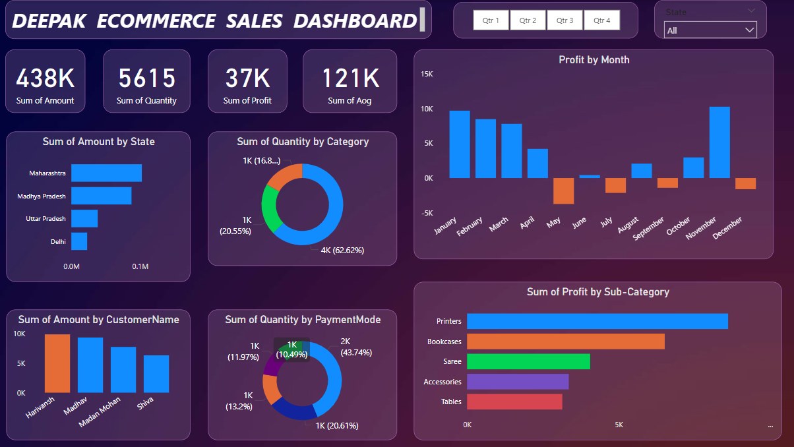

# Deepak E-commerce Sales Dashboard

## Description
This repository contains the Power BI dashboard project showcasing key metrics and insights for the Deepak E-commerce platform. The dashboard visualizes sales performance across various dimensions like state, category, payment mode, customer, and month. It is designed to provide a comprehensive view of sales trends and profitability.

## Features
- **Key Metrics**: Includes total sales amount, quantity, profit, and average order value (AOV).
- **Visualizations**:
  - Bar charts for sales and profit distribution by state and sub-category.
  - Pie charts for quantity distribution by category and payment mode.
  - Monthly profit trends.
  - Top customers by sales amount.
- **Interactive Filters**: Includes quarter and state filters for dynamic analysis.
- **Scalability**: The design allows for easy expansion with additional datasets or new visualizations.
- **User-Friendly**: Clear layout and interactive elements for enhanced usability.

## Files
- `Details.csv`: Contains customer details used in the analysis.
- `Orders.csv`: Includes order data with sales, quantity, and profit information.
- `DASH.png`: Snapshot of the Power BI dashboard.



## Setup
1. Clone the repository:
   ```bash
   git clone <repository_url>
   ```
2. Open the `Details.csv` and `Orders.csv` files in Power BI.
3. Recreate or view the dashboard using the `DASH.png` as a reference.
4. Customize the dashboard by adding new filters or visuals as needed.

## Usage
This dashboard is suitable for:
- Business performance monitoring.
- Identifying top-performing products and regions.
- Analyzing sales and profit trends.
- Supporting data-driven decision-making for business strategies.

## Insights Provided
- **State-Level Analysis**: Understand which states contribute the most to sales and profit.
- **Category Performance**: Identify top-performing product categories.
- **Payment Mode Insights**: Evaluate the popularity of different payment methods.
- **Customer Trends**: Discover key customers driving sales.
- **Seasonal Trends**: Assess monthly and quarterly performance variations.

## License
This project is licensed under the MIT License.

---

_Developed with passion for data insights._
